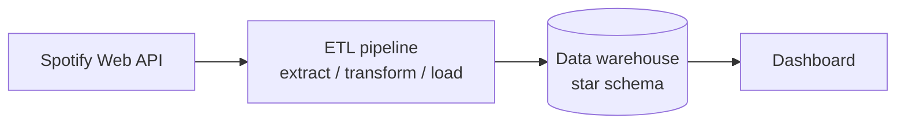
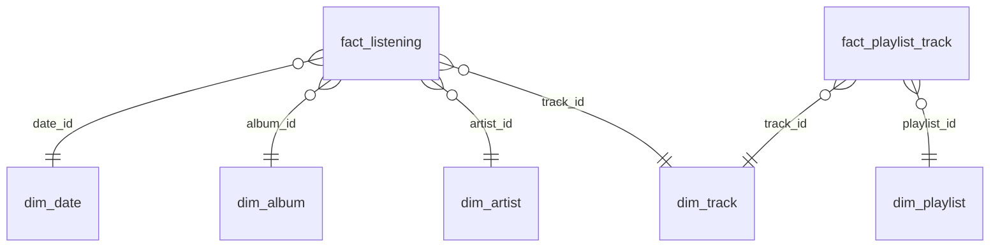

# Spotify Analytics

A data engineering learning project: an end-to-end analytics platform that
tracks artists, albums, playlists and listening trends using data from the
[Spotify Web API](https://developer.spotify.com/documentation/web-api).

> **Status:** planning. The architecture below describes the target state;
> the implementation is tracked as GitHub issues.

## What this project builds

A music analytics platform that answers questions such as:

- Which artists and genres dominate my listening, and how does that change
  over time?
- At which times of day and on which weekdays do I listen the most?
- How do artist popularity and follower counts develop?
- How are my playlists composed (artists, albums, release years, track
  length)?

## Learning goals

| Topic | What is practiced |
| --- | --- |
| API ingestion | OAuth authentication, pagination, rate limits, retries against the Spotify Web API |
| Incremental loading | Loading only new or changed records using watermarks (e.g. `played_at` cursor for recently played tracks) |
| Star schema design | Modeling facts and dimensions for analytical queries in a data warehouse |
| Dashboarding | Turning warehouse tables into listening-trend visualizations |

## Architecture



1. **Extract:** pull data from the Spotify Web API (recently played tracks,
   top artists/tracks, playlists, artist and album metadata).
2. **Transform:** clean, deduplicate and flatten the JSON responses into
   tabular form.
3. **Load:** write incrementally into the data warehouse; only records newer
   than the last successful load are appended.
4. **Serve:** a dashboard reads from the warehouse and visualizes listening
   trends.

## Data model (draft)

Star schema with listening events as the central fact table:



| Table | Grain / content |
| --- | --- |
| `fact_listening` | One row per played track (`played_at`, duration, context) |
| `fact_playlist_track` | One row per track in a playlist snapshot |
| `dim_track` | Track name, duration, explicit flag, popularity |
| `dim_artist` | Artist name, genres, popularity, followers |
| `dim_album` | Album name, type, release date, label |
| `dim_playlist` | Playlist name, owner, description |
| `dim_date` | Calendar attributes (day, weekday, month, year, hour) |

## Tech stack (proposed)

- **Language:** Python (formatted with `black`, linted with `ruff`)
- **API client:** [spotipy](https://spotipy.readthedocs.io/)
- **Data processing:** pandas
- **Warehouse:** PostgreSQL (e.g. via Neon) or DuckDB for local development
- **Dashboard:** to be decided (e.g. Streamlit or Metabase)

## Getting started

Prerequisites:

1. A Spotify account and an app registered in the
   [Spotify Developer Dashboard](https://developer.spotify.com/dashboard)
   (provides client ID and client secret).
2. Python 3.11+.

Credentials are read from environment variables and must never be
committed:

```bash
export SPOTIPY_CLIENT_ID="..."
export SPOTIPY_CLIENT_SECRET="..."
export SPOTIPY_REDIRECT_URI="http://127.0.0.1:8888/callback"
```

Installation and run instructions will be added once the pipeline exists.

## Repository structure

| Path | Purpose |
| --- | --- |
| `CLAUDE.md`, `CLAUDE_CODING_RULES.md` | Project context and coding rules for Claude Code sessions |
| `HANDOVER.md` | Current working state and work plan |
| `docs/` | Documentation and handover archive |
| `plans/` | Implementation plans (`YYYY-MM-DD_name.md`) |

## Roadmap

- [ ] Spotify API authentication and extraction of recently played tracks
- [ ] Incremental loading with a watermark
- [ ] Star schema in the warehouse
- [ ] Artist, album and playlist dimensions
- [ ] Dashboard for listening trends
- [ ] Scheduling / orchestration of the pipeline
