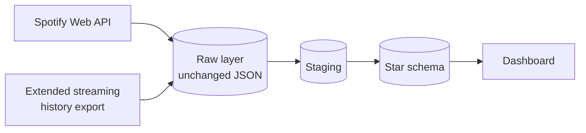
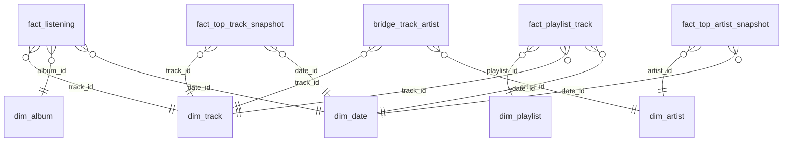

# Spotify Analytics

A data engineering learning project: an end-to-end analytics platform that
tracks artists, albums, playlists and listening trends using data from the
[Spotify Web API](https://developer.spotify.com/documentation/web-api).

> **Status:** planning. The architecture below describes the target state;
> the implementation is tracked as GitHub issues.

## What this project builds

A music analytics platform that answers questions such as:

- Which artists and genres dominate my listening, and how does that change
  over time?
- At which times of day and on which weekdays do I listen the most?
- How do my top artists and top tracks change over time?
- How are my playlists composed (artists, albums, release years, track
  length)?

## Learning goals

| Topic | What is practiced |
| --- | --- |
| API ingestion | OAuth authentication, pagination, rate limits, retries against the Spotify Web API |
| Incremental loading | Loading only new or changed records using watermarks (`played_at` cursor for recently played tracks, `snapshot_id` for playlists) |
| Backfill | Merging a one-off historical export with the incremental API data without duplicates |
| Star schema design | Modeling facts, dimensions, bridge tables and periodic snapshots in a data warehouse |
| Orchestration | Running the pipeline idempotently on a schedule |
| Data quality | Tests for uniqueness, completeness and referential integrity |
| Dashboarding | Turning warehouse tables into listening-trend visualizations |

## Spotify API constraints

The following constraints shape the design (see the
[February 2026 migration guide](https://developer.spotify.com/documentation/web-api/tutorials/february-2026-migration-guide)):

- **Development mode only.** Since May 2025 extended quota mode is only
  granted to organizations, so this project runs in development mode. The
  app owner needs Spotify Premium.
- **Removed fields.** Development mode apps no longer receive `popularity`
  (tracks, albums, artists), `followers` (artists) or `label` (albums).
  Artist `genres` is deprecated and may be empty.
- **No batch endpoints.** Artists and albums are fetched one request at a
  time, so only IDs not yet in the warehouse are fetched.
- **Playlists.** Playlist items are only returned for playlists the user
  owns or collaborates on.
- **Recently played holds 50 plays.** Plays beyond the last 50 between two
  pipeline runs are lost, so the pipeline runs hourly from the start.
- **Refresh tokens expire** six months after the original authorization.
  The token refresh then fails with `invalid_grant` and one interactive
  login is needed.
- **No listening duration.** The API only returns the track length. The
  extended streaming history export (see "Getting started") provides
  `ms_played` and `skipped`.

## Architecture



1. **Extract:** pull data from the Spotify Web API every hour (recently
   played tracks, top artists/tracks, own playlists, artist and album
   metadata), plus a one-off backfill from the extended streaming history
   export.
2. **Load raw:** store the responses unchanged. The API does not return
   past plays again, so the raw layer is the only way to rebuild the model
   after a transformation bug or a model change.
3. **Transform:** clean, deduplicate and flatten the raw JSON into staging
   tables and the star schema (ELT). `played_at` is stored in UTC and
   converted to Europe/Berlin for time-of-day and weekday analysis.
4. **Serve:** a dashboard reads from the star schema.

Every load is idempotent: re-running it with the same input creates no
duplicates (unique keys, `ON CONFLICT DO NOTHING`).

## Data model (draft)

Star schema with listening events as the central fact table:



| Table | Grain / content |
| --- | --- |
| `fact_listening` | One row per play: `played_at` (UTC, unique), local hour, `context_type`, `context_uri`; `ms_played` and `skipped` from the export only |
| `fact_top_artist_snapshot` | One row per snapshot date, time range and rank |
| `fact_top_track_snapshot` | One row per snapshot date, time range and rank |
| `fact_playlist_track` | One row per track in a playlist snapshot; reloaded only when the playlist's `snapshot_id` changes |
| `bridge_track_artist` | One row per track and artist (a track can have several artists) |
| `dim_track` | Track name, duration, explicit flag |
| `dim_artist` | Artist name, genres (may be empty) |
| `dim_album` | Album name, type, release date and its precision (year, month or day) |
| `dim_playlist` | Playlist name, owner, description |
| `dim_date` | Calendar attributes (day, weekday, month, year); the hour of day lives in the fact tables |

## Tech stack (proposed)

- **Language:** Python (formatted with `black`, linted with `ruff`)
- **API client:** [spotipy](https://spotipy.readthedocs.io/)
- **Warehouse:** PostgreSQL on Neon, one database for development and
  scheduled runs
- **Transformation:** SQL models with dbt (staging, star schema, data
  tests)
- **Orchestration:** GitHub Actions cron, hourly (GitHub disables scheduled
  workflows in public repositories after 60 days without activity)
- **Dashboard:** Streamlit

## Getting started

Prerequisites:

1. A Spotify Premium account and an app registered in the
   [Spotify Developer Dashboard](https://developer.spotify.com/dashboard)
   (provides client ID and client secret).
2. Python 3.11+.
3. Recommended: request the extended streaming history under "Download
   your data" in the
   [Spotify privacy settings](https://www.spotify.com/account/privacy/).
   Delivery takes up to 30 days; the export is the backfill source for all
   plays before the pipeline started.

Credentials are read from environment variables and must never be
committed:

```bash
export SPOTIPY_CLIENT_ID="..."
export SPOTIPY_CLIENT_SECRET="..."
export SPOTIPY_REDIRECT_URI="http://127.0.0.1:8888/callback"
```

The pipeline uses the Authorization Code flow with the scopes
`user-read-recently-played`, `user-top-read`, `playlist-read-private` and
`playlist-read-collaborative`. The first authorization needs a browser
login; scheduled runs then use the stored refresh token (kept as a secret,
renewed every six months).

Installation and run instructions will be added once the pipeline exists.

## Repository structure

| Path | Purpose |
| --- | --- |
| `CLAUDE.md`, `CLAUDE_CODING_RULES.md` | Project context and coding rules for Claude Code sessions |
| `HANDOVER.md` | Current working state and work plan |
| `docs/` | Documentation and handover archive |
| `plans/` | Implementation plans (`YYYY-MM-DD_name.md`) |

## Roadmap

- [ ] Manual setup: Spotify app, first authorization, request the
      streaming history export, record sample API responses as test
      fixtures
- [ ] Authentication and extraction of recently played tracks into the raw
      layer
- [ ] Incremental, idempotent loading with a `played_at` watermark and an
      hourly schedule
- [ ] Staging models, `fact_listening` and dimensions incl.
      `bridge_track_artist`
- [ ] Backfill from the extended streaming history export
- [ ] Top artist/track snapshots and playlists
- [ ] Dashboard for listening trends
